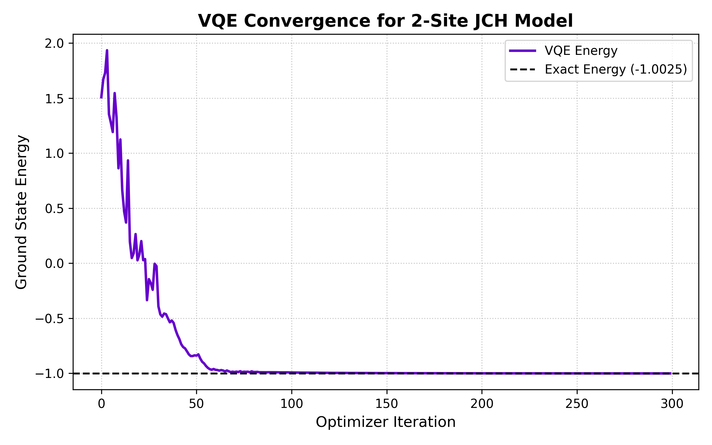

# JCH-VQE Benchmarker

A high-performance benchmarking tool evaluating the convergence of the Variational Quantum Eigensolver (VQE) for the Jaynes-Cummings-Hubbard (JCH) model. 

This repository demonstrates the end-to-end mapping of multi-body lattice physics to quantum hardware simulations, bridging high-level physics research with production-grade algorithmic engineering.

## 🚀 Project Highlights
* **Hamiltonian Mapping:** Custom translation of 2-site JCH tensor products (Fock ⊗ Spin basis) into Qiskit `SparsePauliOp` strings.
* **Algorithm Validation:** Executes a hardware-efficient `TwoLocal` ansatz using Qiskit 1.x Primitives (`StatevectorEstimator`).
* **Cross-Validation:** Benchmarks VQE convergence against exact exact diagonalization, achieving near-chemical accuracy (Error $\Delta \approx 0.0016$).
* **Engineering Standards:** Fully reproducible environment with automated `pytest` verification for operator hermiticity.

## 📊 Results: VQE Convergence
The algorithm successfully minimizes the energy state of the 4-qubit mapped system, converging accurately on the exact ground state within 300 iterations using the COBYLA optimizer.



## 💻 Getting Started

### Prerequisites
Ensure you have Python 3.10+ installed.

### Installation
Clone the repository and install the pinned dependencies:
```bash
git clone [https://github.com/VedantMahadik-qc/vqe-jch-benchmark.git](https://github.com/VedantMahadik-qc/vqe-jch-benchmark)
cd vqe-jch-benchmark
python -m venv venv
source venv/bin/activate  # On Windows use: .\venv\Scripts\activate
pip install -r requirements.txt